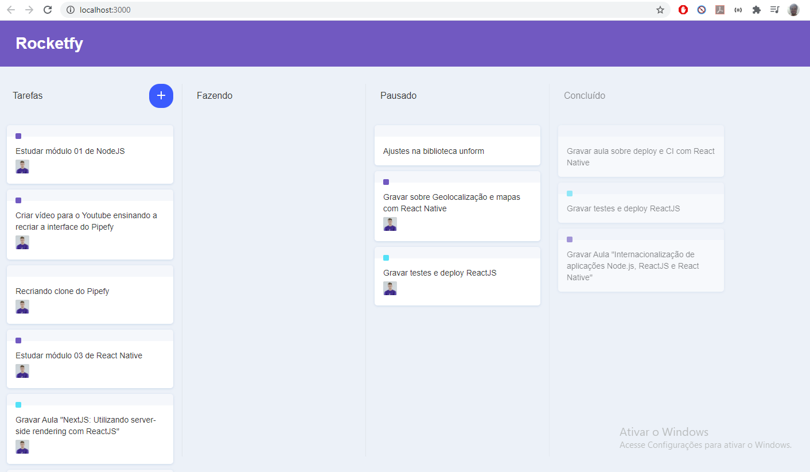

<h1 align="center">
    
</h1>

<h2 title='#projeto'>
    Projeto
</h2>
Recriando algumas funcionalidades do Pipefy através das vídeos aulas da Rocketseat.

<h2 title='#tecnologias'>
    Tecnologias
</h2>

Esse projeto foi desenvolvido com as seguintes tecnologias:

- Reactjs

<h2 title='#bibliotecas'>
    Bibliotecas
</h2>

Foram utilizadas as seguintes bibliotecas:
- immer
- react-icons
- react-dnd-html
- react-dnd-html5-backend
- styled-components

Este projeto foi iniciado com [Create React App](https://github.com/facebook/create-react-app).

Video aula [Rocketseat](https://www.youtube.com/watch?v=awRtgpRsdTQ&t=97s).

## Script de execução do projeto

No diretório do projeto, você pode executar:

### `npm install`

Instala as dependências necessárias para a execução do projeto.  

### `npm start`

Executa o aplicativo no modo de desenvolvimento.  
Abra [http://localhost:3000](http://localhost:3000) para visualizá-lo no navegador.

